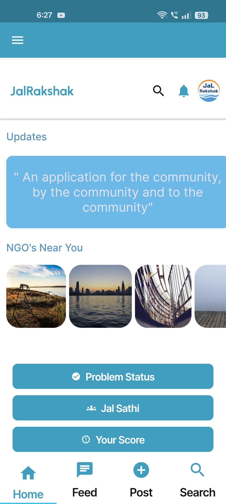
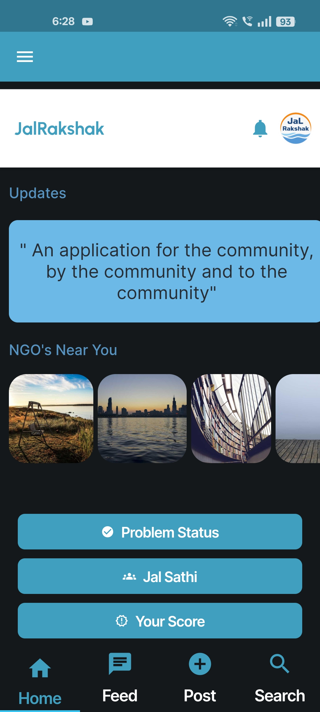
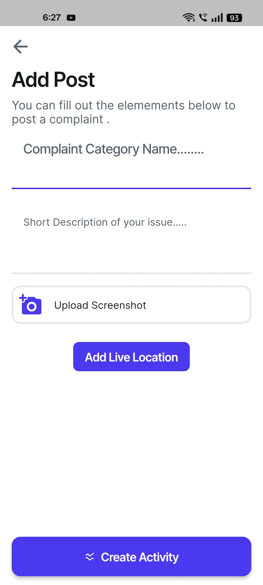

# 🌊 JalRakshak

*Empowering Change Through Innovative Water Management Solutions*


[](https://github.com/Ayush-Sharma99/JaLRakshak/stargazers)
[](https://github.com/Ayush-Sharma99/JaLRakshak/network/members)
[](https://github.com/Ayush-Sharma99/JaLRakshak/issues)
[](https://github.com/Ayush-Sharma99/JaLRakshak/blob/main/LICENSE)


---

## 📑 Table of Contents

- [🌊 JalRakshak](#-jalrakshak)
  - [📑 Table of Contents](#-table-of-contents)
  - [📘 Overview](#-overview)
    - [🎯 What is JalRakshak?](#-what-is-jalrakshak)
    - [🔑 Key Features](#-key-features)
    - [🏗️ Architecture](#️-architecture)
  - [🚀 Getting Started](#-getting-started)
    - [📋 Prerequisites](#-prerequisites)
    - [⚙️ Installation](#️-installation)
    - [🔧 Configuration](#-configuration)
  - [▶️ Usage](#️-usage)
    - [🏃‍♂️ Running the Application](#️-running-the-application)
    - [📱 Platform-Specific Instructions](#-platform-specific-instructions)
  - [🧪 Testing](#-testing)
  - [📸 Screenshots](#-screenshots)
  - [🎥 Video Demo](#-video-demo)
  - [🤝 Contributing](#-contributing)
  - [📄 License](#-license)
  - [👥 Authors](#-authors)
  - [🙏 Acknowledgments](#-acknowledgments)

---

## 📘 Overview

### 🎯 What is JalRakshak?

**JalRakshak** (Water Guardian) is a comprehensive Flutter-based mobile application designed to revolutionize water management and conservation efforts. Built with cutting-edge technology, it provides a unified platform for water-related complaint management, real-time monitoring, and community engagement across multiple platforms.

> **"Jal"** means water in Hindi, and **"Rakshak"** means guardian or protector. Together, JalRakshak represents our commitment to protecting and managing water resources through technology.

### 🔑 Key Features

#### 🔐 **Authentication & Security**
- Multi-provider authentication (Google, Apple, GitHub, Email)
- Anonymous login support
- JWT token-based security
- Role-based access control (User/Admin)

#### 🗺️ **Location & Mapping**
- Real-time GPS tracking and geolocation
- Interactive Google Maps integration
- Geospatial data visualization
- Location-based complaint reporting

#### 📊 **Data Management**
- Real-time Firestore database integration
- Cloud Functions for backend processing
- Offline data synchronization
- Advanced data analytics

#### 🌍 **Cross-Platform Support**
- Android & iOS native performance
- Progressive Web App (PWA) support
- Linux desktop application
- Responsive design for all screen sizes

#### 🎨 **User Experience**
- Intuitive Material Design UI
- Dark/Light theme support
- Multi-language localization
- Accessibility features

#### 📱 **Core Functionality**
- Water-related complaint submission
- Real-time complaint tracking
- Admin dashboard for management
- Push notifications
- Media upload and validation
- Report generation

### 🏗️ Architecture

```
JalRakshak/
├── lib/
│   ├── core/           # Core utilities and constants
│   ├── data/           # Data layer (repositories, models)
│   ├── domain/         # Business logic layer
│   ├── presentation/   # UI layer (screens, widgets)
│   └── services/       # External services integration
├── assets/             # Images, fonts, and other assets
├── test/              # Unit and widget tests
└── integration_test/  # Integration tests
```

---

## 🚀 Getting Started

### 📋 Prerequisites

Before you begin, ensure you have the following installed:

| Requirement | Version | Purpose |
|-------------|---------|---------|
| **Flutter SDK** | ≥ 3.0.0 | Cross-platform development |
| **Dart SDK** | ≥ 2.17.0 | Programming language |
| **Android Studio** | Latest | Android development |
| **Xcode** | Latest (macOS only) | iOS development |
| **Git** | Latest | Version control |

**Additional Tools:**
- **Firebase CLI** - For backend services
- **Google Maps API Key** - For location services
- **Android SDK** - For Android builds
- **CocoaPods** - For iOS dependencies (macOS only)

### ⚙️ Installation

1. **Clone the repository**
   ```
   git clone https://github.com/Ayush-Sharma99/JaLRakshak.git
   cd JaLRakshak
   ```

2. **Install Flutter dependencies**
   ```
   flutter pub get
   ```

3. **Install platform-specific dependencies**
   
   **For iOS (macOS only):**
   ```
   cd ios && pod install && cd ..
   ```
   
   **For Android:**
   ```
   flutter build apk --debug
   ```

4. **Verify installation**
   ```
   flutter doctor
   ```

### 🔧 Configuration

1. **Firebase Setup**
   - Create a new Firebase project at [Firebase Console](https://console.firebase.google.com/)
   - Add your Android/iOS app to the project
   - Download and place configuration files:
     - `google-services.json` → `android/app/`
     - `GoogleService-Info.plist` → `ios/Runner/`

2. **Google Maps API**
   - Get API key from [Google Cloud Console](https://console.cloud.google.com/)
   - Add to `android/app/src/main/AndroidManifest.xml`:
     ```
     
     ```
   - Add to `ios/Runner/AppDelegate.swift`:
     ```
     GMSServices.provideAPIKey("YOUR_API_KEY_HERE")
     ```

3. **Environment Variables**
   Create a `.env` file in the root directory:
   ```
   GOOGLE_MAPS_API_KEY=your_api_key_here
   FIREBASE_PROJECT_ID=your_project_id
   ```

---

## ▶️ Usage

### 🏃‍♂️ Running the Application

**Development Mode:**
```
flutter run
```

**Specific Platform:**
```
# Android
flutter run -d android

# iOS
flutter run -d ios

# Web
flutter run -d web-server --web-port 8080

# Linux
flutter run -d linux
```

**Production Build:**
```
# Android APK
flutter build apk --release

# iOS
flutter build ios --release

# Web
flutter build web --release
```

### 📱 Platform-Specific Instructions

#### Android
- Minimum SDK: 21 (Android 5.0)
- Target SDK: 33 (Android 13)
- Permissions: Location, Camera, Storage

#### iOS
- Minimum iOS: 11.0
- Required: Location permissions in Info.plist

#### Web
- Supported browsers: Chrome, Firefox, Safari, Edge
- PWA capabilities enabled

---

## 🧪 Testing

JalRakshak includes comprehensive testing coverage:

**Run all tests:**
```
flutter test
```

**Run specific test types:**
```
# Unit tests
flutter test test/unit/

# Widget tests
flutter test test/widget/

# Integration tests
flutter test integration_test/
```

**Test coverage:**
```
flutter test --coverage
genhtml coverage/lcov.info -o coverage/html
```

**Test Structure:**
- **Unit Tests**: Business logic and utilities
- **Widget Tests**: UI components and interactions
- **Integration Tests**: End-to-end user flows

---

## 📸 Screenshots


| Home Screen | Home Screen (Dark) | Complaint Form |
|-------------|---------------------|----------------|
|  |  |  |

| Profile | Problem Status | Leaderboard |
|----------|---------|---------------|
|  |  |  |


> **Note:** Add your app screenshots to `assets/screenshots/` directory and update the file names accordingly.

---

## 🎥 Video Explanation


[▶️[Watch the demo]](https://drive.google.com/file/d/1H_iF9AnDijcqce3XWf6DIXjtRf4u0p6V/view)

**Watch the complete walkthrough of JalRakshak's features and functionality**


---
## 🎥 Prototype Demo


[▶️[Watch the demo]](https://drive.google.com/file/d/1u_VmluJP5A_0UY4fTwBCgkOOuuPKKr83/view)

**Watch How the working Prototype looks like**


> Replace `YOUR_VIDEO_ID_HERE` with your actual YouTube video ID.

---

## 🤝 Contributing

We welcome contributions! Please see our [Contributing Guidelines](CONTRIBUTING.md) for details.

### Development Workflow

1. **Fork** the repository
2. **Create** a feature branch (`git checkout -b feature/amazing-feature`)
3. **Commit** your changes (`git commit -m 'Add amazing feature'`)
4. **Push** to the branch (`git push origin feature/amazing-feature`)
5. **Open** a Pull Request

### Code Style

- Follow [Dart Style Guide](https://dart.dev/guides/language/effective-dart/style)
- Use `flutter analyze` to check code quality
- Format code with `dart format .`

---

## 🙏 Acknowledgments

- Flutter team for the amazing framework
- Firebase for backend services
- Google Maps for location services
- The open-source community for inspiration and support

---

**Made with ❤️ for water conservation**

[⬆ Back to top](#-jalrakshak)# Jal-Rakshak-Fence
